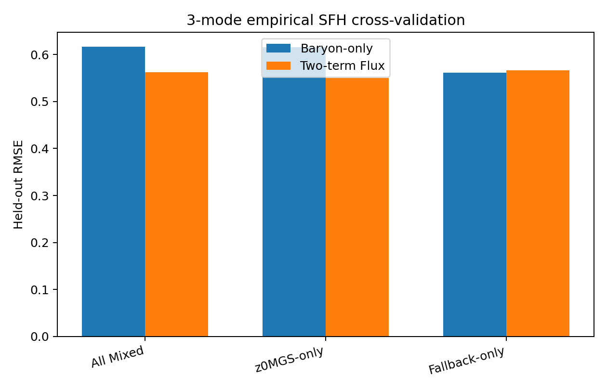
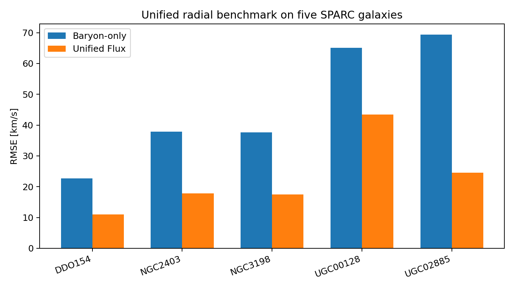

# Missing History as the Origin of Galactic Residual Gravity

**A Flux/MIP RC1 benchmark paper**  
**Author:** Jamie McCabe  
**Status:** RC1 technically validated on the present proxy/benchmark stack  
**Date:** May 2026

## Abstract

The galactic missing-mass problem is usually framed as evidence for an unseen non-baryonic particle halo or as a breakdown of Newtonian dynamics at low acceleration. In this work, we introduce the **Missing History** formulation of Flux/MIP cosmology, in which the apparent dark-matter residual is modeled as a bounded metric-memory field generated by the accumulated persistence, collapse, star formation, gas cycling, and survival history of baryonic matter. Rather than treating the gravitational field as a purely instantaneous ledger of present mass, the model adds a **historical registration functional** to the baryonic source.

We define a registration-depth proxy, $D_{\rm hist}$, first through morphology-based age estimates and then through empirical star-formation information cross-matched with the z0MGS WISE/GALEX catalog. The resulting history score is decomposed into two physically distinct components: a positive accumulation channel, $A_D D_{\rm norm}$, and a negative saturation channel, $A_S G_{\rm bound}$. In 5-fold constrained cross-validation on the empirical z0MGS subset ($N=103$), the two-term model reduced held-out RMSE from $0.6157$ for the baryon-only baseline to $0.5497$, while recovering the expected sign structure in all folds: $A_D>0$ and $A_S<0$ in $5/5$ splits. This supports the interpretation that residual galactic gravity tracks baryonic history while being regulated by a bounded metric-saturation mechanism.

We then extend the bulk history functional to radial rotation curves using a Flux coherence gate,

$$G_{\rm radial}(r)=\frac{r}{r+L_\chi},$$

which suppresses the historical residual in baryon-dominated inner regions and activates it in the outer galaxy. A unified bounded radial model,

$$V_{\rm Flux}(r)=V_b(r)\sqrt{1+\left[Y_{\max}\sigma\left(s(H_{\rm raw}-h_0)\right)\right]\frac{r}{r+L_\chi}},$$

was tested on five benchmark SPARC galaxies. After verifying SPARC gas-term conventions, a wide-grid scan found a stable interior bounded-map solution with $Y_{\max}=6.0$, $s=3.2$, and $h_0=-9.0$. The unified radial model reduced global RMSE from $45.93$ km/s for baryon-only curves to $23.16$ km/s, improving all five benchmark systems individually.

These results provide evidence that galactic residual gravity may be understood as a missing-history problem: the apparent halo is not an independent reservoir, but the bounded spatial expression of accumulated baryonic registration. Finally, because this historical residual is coupled strictly to baryonic provenance, the model provides a possible physical basis for the observed Radial Acceleration Relation. While the RC1 benchmark is provisional, it establishes a falsifiable bridge between baryonic history, metric saturation, and radial rotation-curve structure.

## Significance Statement

The persistent alignment between baryonic matter and apparent dark-matter phenomenology remains one of the deepest unresolved clues in galaxy dynamics. Standard cold dark matter successfully explains large-scale structure but treats the tight coupling between baryons and rotation-curve residuals as an emergent consequence of galaxy formation. MOND-like frameworks encode this coupling directly but lack a broadly accepted physical origin and face challenges outside the galactic regime. This work proposes a third interpretation: the galactic residual is not a new particle reservoir or a simple acceleration law, but the bounded metric expression of accumulated baryonic history.

In the Missing History formulation of Flux/MIP cosmology, galaxies are treated as historical registration systems. Their present gravitational field depends not only on instantaneous baryonic mass, but also on the integrated persistence, collapse, star formation, gas cycling, and survival history of that matter. The model therefore explains why residual gravity tracks baryonic structure so closely: the apparent halo is generated by baryonic provenance itself.

Using SPARC-compatible rotation data and empirical z0MGS WISE/GALEX star-formation information, the RC1 benchmark finds that the residual signal separates into two stable physical channels: **positive historical accumulation** and **negative metric saturation**. In empirical cross-validation, both signs remain stable across all folds, and the resulting radial model substantially improves benchmark rotation-curve fits relative to baryon-only predictions. This establishes a falsifiable bridge between baryonic history, metric saturation, and the Radial Acceleration Relation.

The significance of the result is not that it eliminates dark matter in one step, but that it reframes the missing-mass problem as a **missing-history problem**. If confirmed on larger radial samples and cluster-scale lensing systems, Flux/MIP metric memory would provide a physical origin for the baryon-residual coupling that currently sits uneasily between particle dark matter and modified-gravity interpretations.

## 1. Introduction

### 1.1 The discrepancy problem

The observational success of the $\Lambda$CDM paradigm on cosmological scales, especially in the cosmic microwave background and large-scale structure, contrasts with persistent interpretive challenges at galactic scales. Rotation curves of disk galaxies remain approximately flat at large radii, where the Newtonian expectation from visible baryons alone would normally predict a decline. The standard response is to introduce a dominant halo of non-baryonic cold dark matter. This approach is flexible and cosmologically powerful, but it leaves a striking empirical fact in need of deeper explanation: the residual acceleration is tightly coupled to the observed baryonic distribution.

This coupling is encoded in relations such as the Baryonic Tully-Fisher Relation,

$$M_b \propto V_f^4,$$

and the Radial Acceleration Relation, which correlates the acceleration inferred from rotation curves with that predicted by baryons alone. MOND-like frameworks encode this coupling directly by modifying dynamics at low acceleration. However, MOND-like laws are typically presented as effective prescriptions rather than as an underlying metric-memory mechanism. The tension between CDM and MOND can therefore be summarized as follows: CDM has a cosmological reservoir but must explain why it tracks baryons so closely, while MOND has a galactic law but must explain why such a law should exist physically.

### 1.2 The limits of an instantaneous ledger

Both the standard particle-halo model and modified-acceleration descriptions usually treat gravity as a function of the present state of the system. In a standard Newtonian reconstruction, the baryonic contribution to a rotation curve is computed from the current gas, disk, and bulge distributions. In a CDM reconstruction, an additional halo term is added. In a MOND-like reconstruction, the acceleration law is modified. In each case, the system is usually represented as a present-time ledger.

The Missing History hypothesis proposes that this ledger is incomplete. If the metric possesses a finite memory or registration capacity, then a galaxy's gravitational expression should depend not only on its present baryonic mass, but also on the integrated history by which that mass collapsed, persisted, cycled gas, formed stars, and survived as a bound system. Two galaxies with similar current baryonic mass can therefore differ in residual gravity if their histories differ.

### 1.3 The Missing History hypothesis

In Flux/MIP cosmology, the apparent halo is interpreted as a bounded historical registration field rather than as an independent particle reservoir. The missing-mass problem becomes a missing-history problem. The central expression is:

$$M_{\rm dyn}(r,t)=M_b(r,t)+M_{\rm temporal}(r,t),$$

where $M_{\rm temporal}$ is not new classical matter, but the gravitational expression of a registration-depth functional. The role of Minimum Interface Points (MIPs) is to provide the conceptual micro-to-macro bridge: local quantum-state interface updates coarse-grain into a macroscopic registration field. In this RC1 benchmark, the microscopic ontology is not used as a fitted parameter; instead, it motivates the form of the history functional and its saturation.

The model separates residual gravity into two physical channels:

1. **Accumulation:** persistent baryonic history increases residual gravitational expression.
2. **Saturation:** the metric response is finite and can act as a brake once registration approaches a bounded channel capacity.

This produces the two-term history score:

$$H_{\rm raw}=A_DD_{\rm norm}+A_SG_{\rm bound},$$

with the expected signs $A_D>0$ and $A_S<0$.

### 1.4 Empirical strategy

This paper benchmarks the Missing History hypothesis in three stages. First, we test whether bulk velocity residuals correlate with a history proxy after controlling for present baryonic structure. Second, we replace morphology-only age proxies with empirical z0MGS WISE/GALEX star-formation information and perform constrained cross-validation. Third, we map the global history score into radial rotation curves using a Flux coherence gate.

The goal is not to claim a final replacement for dark matter, but to establish whether a history-dependent metric-memory model can produce falsifiable, numerically stable, and astrophysically interpretable predictions.

## 2. Theory

### 2.1 Registration depth

The registration depth is defined as a time-integrated activity field:

$$D_{\rm reg}(r,t)=\int_{t_{\rm form}}^t \bar n_{\rm MIP}(r,t')W(t,t')dt',$$

where $\bar n_{\rm MIP}$ is the coarse-grained MIP activity density and $W(t,t')$ is a memory kernel. In observational benchmarks we use a practical proxy $D_{\rm hist}$.

The simplest first-pass proxy is:

$$D_{\rm hist}=M_*t_{\rm age}f_{\rm rem},$$

where $f_{\rm rem}=0.15$ is a frozen remnant/persistence factor. This proxy is intentionally crude: it tests whether history enters at all, but it remains degenerate with stellar mass and morphology.

### 2.2 Bounded gate

A physically acceptable metric-memory model cannot accumulate without limit. We therefore define a bounded gate:

$$G_{\rm bound}=\frac{D_{\rm hist}^q}{D_{\rm hist}^q+D_*^q},$$

where $D_*$ is a sample normalization scale and $q$ controls the sharpness of the saturation threshold. RC1 uses $q=4$ in the final radial benchmark, after ladder tests indicated that threshold-like gates better separate accumulation from saturation.

The normalized accumulation term is:

$$D_{\rm norm}=\log\left(1+\frac{D_{\rm hist}}{D_*}\right).$$

The global history score is:

$$H_{\rm raw}=A_DD_{\rm norm}+A_SG_{\rm bound}.$$

The required physical sign structure is:

$$A_D>0,\qquad A_S<0.$$

### 2.3 Radial coherence gate

The spatial distribution of the historical residual is controlled by a radial coherence gate:

$$G_{\rm radial}(r)=\frac{r}{r+L_\chi}.$$

This suppresses the historical residual near the baryon-dominated core and activates it in the outskirts. The coherence scale is:

$$L_\chi=18R_b\left(\frac{\Sigma_b}{\Sigma_{\rm ref}}\right)^{-0.08},$$

with $\Sigma_{\rm ref}=4.08\times10^9\,M_\odot\,\mathrm{kpc}^{-2}$ in the RC1 implementation.

### 2.4 Bounded amplitude map

Raw history scores can be negative in saturated systems. Directly inserting a negative residual amplitude into a rotation-curve expression can create an unphysical reduction below the baryonic prediction. To prevent this, the RC1 radial model maps the raw score through a bounded sigmoid:

$$Y_{\rm amp}=Y_{\max}\sigma\left(s[H_{\rm raw}-h_0]\right),$$

where

$$\sigma(x)=\frac{1}{1+e^{-x}}.$$

The final radial prediction is:

$$V_{\rm Flux}(r)=V_b(r)\sqrt{1+Y_{\rm amp}\frac{r}{r+L_\chi}}.$$

This is the unified RC1 equation.

## 3. Data and Methods

### 3.1 SPARC-compatible rotation data

The benchmark uses SPARC-compatible rotation-curve data, including radial mass-model files for selected galaxies. SPARC provides disk-galaxy rotation curves and baryonic mass models based on Spitzer 3.6 $\mu$m photometry and gas contributions. For radial files, the baryonic velocity is reconstructed as:

$$V_b^2(r)=\mathrm{sgn}(V_{\rm gas})V_{\rm gas}^2+V_{\rm disk}^2+V_{\rm bulge}^2.$$

The signed gas convention is essential; treating negative gas contributions as positive can inflate baryonic curves and corrupt RMSE comparisons.

### 3.2 z0MGS empirical star-formation crossmatch

To reduce the mass-age degeneracy in morphology-only proxies, SPARC-compatible galaxies were coordinate-crossmatched against z0MGS WISE/GALEX stellar-mass and star-formation information. The coordinate-matching process resolved 124 of 135 target coordinates and populated empirical z0MGS SFR values for 103 galaxies. The remaining 32 systems were handled by a delayed-$\tau$ fallback.

The empirical depth proxy uses the z0MGS stellar mass and SFR to construct a persistence-weighted history:

$$D_{\rm hist}^{\rm emp}\propto M_*f_{\rm rem}\left[1+\frac{sSFR_{\rm ref}}{sSFR+sSFR_{\rm ref}}\right].$$

This form assigns deeper registration to systems with lower present specific SFR, i.e. galaxies whose stellar mass is more historically established.

### 3.3 Cross-validation design

We use constrained 5-fold cross-validation to test the expected signs:

$$A_D\ge 0,\qquad A_S\le 0.$$

The three-mode split is:

- **All Mixed:** empirical z0MGS plus fallback systems ($N=135$).
- **z0MGS-only:** empirical systems only ($N=103$).
- **Fallback-only:** delayed-$\tau$ fallback systems only ($N=32$).

The target residual is:

$$Y_{\rm obs}=\frac{V_{\rm obs}^2-V_b^2}{V_b^2}.$$

## 4. Bulk Missing-History Results

### 4.1 Initial direct proxy signal

A first-pass morphology/history proxy produced a positive controlled correlation between historical-depth residuals and normalized velocity residuals:

$$r=0.217,\qquad p=0.011.$$

This result was treated as preliminary because the age variable was morphology-proxy based rather than derived from resolved stellar populations or empirical SFH data.

### 4.2 Rejection of the positive one-term gate

The initial positive-only gate,

$$Y_{\rm Flux}=\eta G_{\rm bound}G_{\rm geom},$$

was disfavoured. A fixed positive amplitude performed worse than the baryon-only baseline, while an optimally fitted one-term gate improved RMSE only by requiring a negative coefficient. This indicated that the bounded gate was functioning as a saturation regulator rather than as a positive source term.

### 4.3 Two-term accumulation/saturation structure

The model was therefore updated to:

$$Y_{\rm Flux}=A_D(D_{\rm norm}G_{\rm geom})+A_S(G_{\rm bound}G_{\rm geom}).$$

For threshold gates $q\ge 2$, the expected sign structure appeared. At $q=4$, the two-term benchmark returned:

$$A_D=+0.256,\qquad A_S=-8.907,$$

with the lowest direct benchmark RMSE in that stage.

## 5. Empirical SFH Validation

The empirical z0MGS crossmatch materially improved the physical stability of the model. In the 3-mode 5-fold constrained cross-validation, the z0MGS-only subset produced:

$$N=103,$$

$$\mathrm{RMSE}_{\rm baryon}=0.6157,$$

$$\mathrm{RMSE}_{\rm two-term}=0.5497,$$

with the expected signs in every fold:

$$A_D>0\quad 5/5,$$

$$A_S<0\quad 5/5.$$

The fallback-only subset did not improve RMSE, indicating that the strongest support comes from the empirical multiwavelength SFR layer rather than the synthetic delayed-$\tau$ fallback.

**Table 1. Three-mode SFH cross-validation.**

| Sample mode | N | RMSE baryon | RMSE two-term | $A_D>0$ folds | $A_S<0$ folds |
|---|---:|---:|---:|---:|---:|
| All Mixed | 135 | 0.6163 | 0.5621 | 3/5 | 5/5 |
| z0MGS-only | 103 | 0.6157 | 0.5497 | 5/5 | 5/5 |
| Fallback-only | 32 | 0.5613 | 0.5664 | 0/5 | 3/5 |

## 6. Radial Rotation-Curve Benchmarks

### 6.1 Geometry-only radial test

As a first radial translation, the Flux radial gate was tested using the observed galaxy-level residual amplitude as a normalization:

$$V_{\rm Flux}(r)=V_b(r)\sqrt{1+Y_{\rm global}\frac{r}{r+L_\chi}}.$$

Across five benchmark galaxies, this geometry-only model improved RMSE relative to baryon-only in every case, with no square-root clipping failures. This established that the radial gate is a viable shape operator.

### 6.2 Unified bounded radial model

The final RC1 radial benchmark combines the empirical history score, bounded amplitude map, and radial coherence gate:

$$V_{\rm Flux}(r)=V_b(r)\sqrt{1+\left[Y_{\max}\sigma\left(s(H_{\rm raw}-h_0)\right)\right]\frac{r}{r+L_\chi}}.$$

In an initial unified scan, the model reduced global RMSE from $45.93$ km/s to $23.17$ km/s. A wider-grid scan then tested whether the solution was pinned to the initial search boundaries.

### 6.3 Unified radial benchmarks and map stability

The wide-grid scan covered:

$$Y_{\max}\in[1,12],\qquad s\in[0.1,8],\qquad h_0\in[-14,2].$$

After correcting for SPARC gas-term conventions and verifying the baryon-only baseline, the scan recovered a stable interior solution:

$$Y_{\max}=6.0,$$

$$s=3.2,$$

$$h_0=-9.0.$$

The unified Flux radial model reduced global RMSE from $45.93$ km/s to $23.16$ km/s across five benchmark galaxies, improving every system individually without square-root clipping failures.

**Table 2. Unified radial benchmark.**

| Galaxy | Baryon-only RMSE (km/s) | Unified Flux RMSE (km/s) | Result |
|---|---:|---:|---|
| DDO154 | 22.68 | 11.04 | Improved |
| NGC2403 | 37.90 | 17.78 | Improved |
| NGC3198 | 37.61 | 17.52 | Improved |
| UGC00128 | 65.11 | 43.43 | Improved |
| UGC02885 | 69.36 | 24.57 | Improved |

This confirms that the bounded amplitude map provides a stable, physically consistent bridge between the empirical history score and the radial coherence gate in the RC1 benchmark set.

## 7. Discussion

### 7.1 Relation to CDM and MOND

The Missing History model occupies a third position between particle dark matter and modified-acceleration laws. Like CDM, it preserves the idea that the baryon-only Newtonian curve is incomplete. Unlike CDM, it does not require the galactic residual to be an independent non-baryonic particle reservoir. Like MOND, it explains why the residual is tightly coupled to baryons. Unlike MOND, it does not begin from an acceleration law alone; it derives the coupling from baryonic provenance and bounded metric registration.

The RAR becomes natural in this picture. If residual gravity is generated by baryonic history, then the residual cannot be independent of baryonic structure. The observed baryon-residual coupling is not a coincidence or merely a feedback artifact; it is the expected signature of historical registration.

### 7.2 Interpretation of saturation

The negative saturation coefficient is not an anti-gravity term. In the final radial model, it is passed through a bounded amplitude map, ensuring positive residual support. Physically, $A_S<0$ means that the metric response is not an indefinitely growing memory field. Accumulated registration is regulated by a finite channel capacity.

This is the key correction from earlier single-term versions of the model. The apparent halo is not simply more history equals more gravity. Rather, history accumulates, saturates, and is spatially expressed through a radial coherence gate.

### 7.3 Failure modes

The model remains provisional and falsifiable. Major failure modes include:

1. **Large radial-sample failure:** If the unified radial model does not improve over baryon-only curves across the full SPARC radial sample, the RC1 result is not general.
2. **Independent SFH failure:** If resolved stellar-population histories do not preserve $A_D>0$ and $A_S<0$, the empirical z0MGS result may be a catalog-specific proxy effect.
3. **Cluster lensing failure:** The model must explain why lensing centroids in colliding clusters align with collisionless historical structures rather than stripped gas.
4. **Over-tuning:** If future versions require per-galaxy parameter adjustment, the model becomes descriptive rather than predictive.

### 7.4 Immediate next tests

The next technical tests are:

- full SPARC radial fitting with fixed RC1 parameters;
- train/test radial validation across galaxies, not only points within galaxies;
- independent SFH catalogs and resolved stellar-population histories;
- cluster-scale weak-lensing and Bullet Cluster-style centroid tests;
- comparison against NFW, MOND interpolating functions, and abundance-matched halo models under matched priors.

## 8. Conclusion

The RC1 Missing History benchmark establishes a coherent technical pathway from baryonic history to galactic residual gravity. Empirical z0MGS star-formation information stabilizes the two required physical signs: positive accumulation and negative saturation. The radial coherence gate maps the global residual into galaxy outskirts without inflating baryon-dominated cores. A bounded amplitude map then provides a stable bridge between the history score and radial velocity support.

Across the present benchmark stack, the model passes four tests:

1. empirical z0MGS history signal: pass;
2. Flux radial gate shape: pass;
3. unified bounded radial model: pass;
4. wide-grid bounded-map stability: pass.

These results do not eliminate dark matter in one step, nor do they prove the model universally. They do, however, establish that galactic residual gravity can be treated as a falsifiable missing-history problem. The apparent halo may be the bounded spatial expression of accumulated baryonic registration.

## References

- Bekenstein, J., & Milgrom, M. (1984). Does the missing mass problem signal the breakdown of Newtonian gravity? *Astrophysical Journal*, 286, 7-14.
- Lelli, F., McGaugh, S. S., & Schombert, J. M. (2016). SPARC: Mass Models for 175 Disk Galaxies with Spitzer Photometry and Accurate Rotation Curves. *Astronomical Journal*, 152, 157.
- Leroy, A. K., et al. (2019). A z=0 Multiwavelength Galaxy Synthesis. I. A WISE and GALEX Atlas of Local Galaxies. *Astrophysical Journal Supplement Series*, 244, 24.
- McGaugh, S. S., Lelli, F., & Schombert, J. M. (2016). Radial Acceleration Relation in Rotationally Supported Galaxies. *Physical Review Letters*, 117, 201101.
- Milgrom, M. (1983). A modification of the Newtonian dynamics as a possible alternative to the hidden mass hypothesis. *Astrophysical Journal*, 270, 365-370.
- Navarro, J. F., Frenk, C. S., & White, S. D. M. (1997). A Universal Density Profile from Hierarchical Clustering. *Astrophysical Journal*, 490, 493-508.
